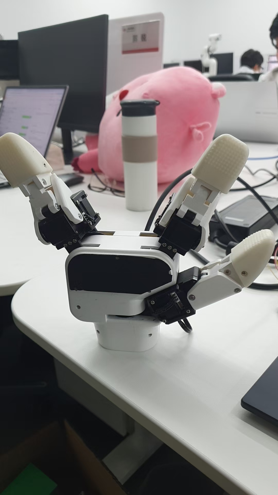

# 自动化脚本测试须知

## 1.脚本注意事项：

1.1 requirements

```
import BeautifulReport
import openpyxl
import ddt
```


1.2修改ddt源码

```
# 注释原有代码 # test_data_docstring = _get_test_data_docstring(func, v) 
# 添加自定义逻辑 test_data_docstring = v["title"] #测试报告描述项改为excel表格中的title列
```

## 2.三指灵巧手注意事项：

2.1 设置零位时，需将夹爪竖立放置



2.2 目前用例覆盖率95%+，涉及运动指令，需观察夹爪角度以及速度是否运行正常，运动时是否抖动

2.3 IO需使用IO开关单独测试


## 3.力控夹爪注意事项：

3.1 目前用例覆盖率95%+，涉及运动指令，需观察夹爪角度以及速度是否运行正常，运动时是否抖动

3.2 获取当前队列的数据量接口（GetQueueCount）接口需配合串口助手手动测试

